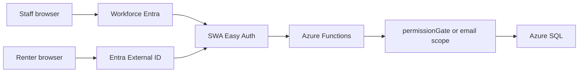

# Authentication and authorization

**Audience:** Agents, implementers  
**Last updated:** 2026-08-30  
**Scope:** How staff and renters prove identity, and how the API grants capabilities.

## Two problems, two systems

| Layer | Question | Answered by |
|-------|----------|-------------|
| **Authentication** | Who is calling? | SWA Easy Auth — workforce Entra (`aad`) for staff, Entra External ID (`externalid`) for renters |
| **Authorization** | What may they do? | Office permission catalog on `office_users` rows; portal scopes every query to the signed-in email |

Sign-in is not permission to act.

Staff are never authorized because they signed in. Renters are never added to the workforce tenant.

## Azure Functions authLevel

Office and portal handlers register with `authLevel: 'anonymous'`. That is required for SWA-linked APIs: Easy Auth runs at the SWA edge and forwards `x-ms-client-principal` to Functions. Authorization is **not** absent — it lives in application code:

| Surface | Gate |
|---------|------|
| SWA edge | `/api/office/*` and `/api/portal/*` require the `authenticated` role; public routes (`/api/apply`, contact, Stripe webhook) are listed explicitly |
| Office API | `officeCaller` requires a workforce (`aad`) principal plus an active `office_users` profile (or allowlist bootstrap); `permissionGate` checks catalog permissions |
| Portal API | `portalCaller` requires a signed-in renter email and scopes queries to that household |

Direct calls to the Function host without a principal receive **401**; resident portal sign-in receives **403** on office routes.

## Public exceptions

| Route | Proof |
|-------|-------|
| `POST /api/contactInquiry` | Cloudflare Turnstile + schema |
| `POST /api/apply` | Cloudflare Turnstile + schema |
| `POST /api/stripeWebhook` | Stripe signature |

`/login` is public and offers Staff office (`/.auth/login/aad`) vs Resident portal (`/.auth/login/externalid`). Workforce Easy Auth uses the single-tenant issuer `https://login.microsoftonline.com/e78bb87b-bdca-4a5f-8f90-a1c388528a5f/v2.0`. Env Terraform sets SWA `AAD_CLIENT_ID` / `AAD_CLIENT_SECRET` from `wcp-office-<env>`.

## Office catalog

Roles: `super_administrator`, `property_manager`, `maintenance`. Discrete IDs live in `api/src/lib/permissions.js`. `ALLOWED_USER_IDS` only bootstraps a missing Super Administrator profile.

Local Functions (`AZURE_FUNCTIONS_ENVIRONMENT=Development`) grant the full catalog.
