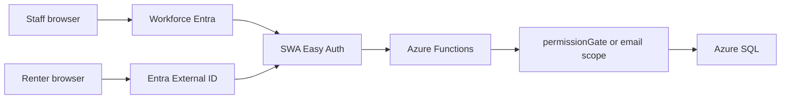

# Authentication and authorization

**Audience:** Agents, implementers  
**Last updated:** 2026-08-28  
**Scope:** How staff and renters prove identity, and how the API grants capabilities.

## Two problems, two systems

| Layer | Question | Answered by |
|-------|----------|-------------|
| **Authentication** | Who is calling? | SWA Easy Auth — workforce Entra (`aad`) for staff, Entra External ID (`externalid`) for renters |
| **Authorization** | What may they do? | Office permission catalog on `office_users` rows; portal scopes every query to the signed-in email |

Sign-in is not permission to act.

Staff are never authorized because they signed in. Renters are never added to the workforce tenant.

## Public exceptions

| Route | Proof |
|-------|-------|
| `POST /api/contactInquiry` | Cloudflare Turnstile + schema |
| `POST /api/apply` | Cloudflare Turnstile + schema |
| `POST /api/stripeWebhook` | Stripe signature |

`/login` is public and offers Staff office (`/.auth/login/aad`) vs Resident portal (`/.auth/login/externalid`).

## Office catalog

Roles: `super_administrator`, `property_manager`, `maintenance`. Discrete IDs live in `api/src/lib/permissions.js`. `ALLOWED_USER_IDS` only bootstraps a missing Super Administrator profile.

Local Functions (`AZURE_FUNCTIONS_ENVIRONMENT=Development`) grant the full catalog.
