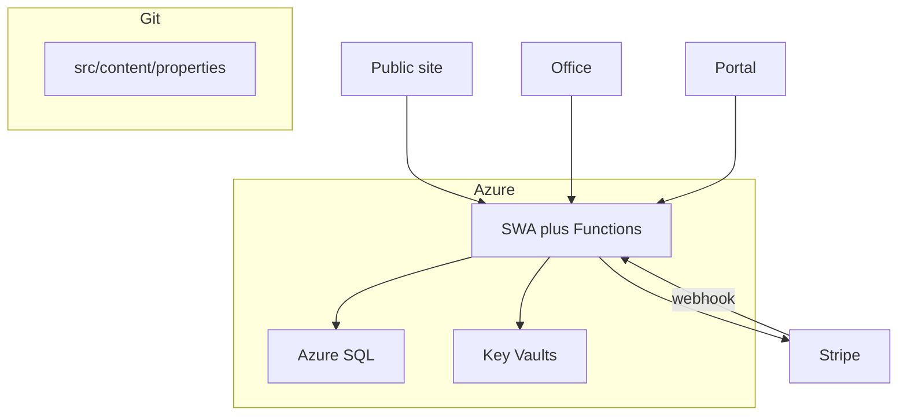

# Data persistence

**Audience:** Agents, implementers  
**Last updated:** 2026-08-29  
**Scope:** Where durable data lives, record shapes, and access paths.

There is **one application database**: Azure SQL (`wcp`). Git holds public brand copy only. Stripe is the money system of record.

Staging currently has `create_sql = false` because this subscription cannot provision Azure SQL in East US 2 or East US (`ProvisioningDisabled`). `SQL-CONNECTION-STRING` in `kv-wcp-staging` is empty; the Functions API falls back to the in-memory store. Re-enable with `create_sql = true` (and a region Azure allows) when the quota exception lands. Prod still defaults to creating SQL.

## Systems of record

| Concern | Store | What lives there |
|---------|-------|------------------|
| **Public brand** | Git (`src/content/`) | Property listings, about page |
| **Operations** | Azure SQL | People, applications, leases, invoices, payments, service requests, office users |
| **Money** | Stripe | Invoices, charges, receipts |
| **Secrets** | Key Vault → SWA app settings | API keys, SQL connection, External ID, Turnstile |
| **Staff identity** | Microsoft Entra (workforce) | Who can complete office login |
| **Renter identity** | Microsoft Entra External ID | Who can complete portal login |

## Azure SQL

Schema: [`api/src/db/schema.sql`](../../api/src/db/schema.sql). Applied on first SQL connect. Seed: three properties and five units (bedrooms and bathrooms).

| Table | Notes |
|-------|-------|
| `properties` / `units` | Seeded; public copy still lives in git |
| `people` | Applicants and renters; unique `email_key` |
| `applications` | Status: submitted, in_review, approved, declined, withdrawn |
| `leases` | Filtered unique index: one **active** lease per unit |
| `invoices` / `payments` | Stripe ids and `receipt_url`; Stripe remains the books |
| `service_requests` | Scoped to `person_id` |
| `office_users` | Workforce identities + roles JSON |

Local/dev and staging (while `create_sql` is false) without `SQL_CONNECTION_STRING` use the in-memory store (`createMemoryStore`) so tests, `func start`, and the public site work offline. In-memory data is not durable across Function restarts.

## Access paths

- Public apply writes `applications`.
- Office APIs require catalog permissions.
- Portal APIs match `people.email_key` to the signed-in email and never return other households' rows.
- Stripe webhook verifies the signature, then updates the matching invoice by `stripe_invoice_id`.
