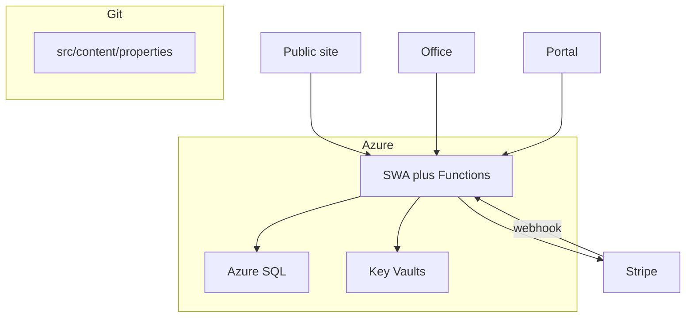

# Data persistence

**Audience:** Agents, implementers  
**Last updated:** 2026-08-30  
**Scope:** Where durable data lives, record shapes, and access paths.

There is **one application database**: Azure SQL (`wcp`). Git holds public brand copy only. Stripe is the money system of record.

Azure SQL lives in **Central US** (`sql_location = centralus`). East US and East US 2 return `ProvisioningDisabled` for new SQL servers on this subscription; SWA, Key Vault, and the rest of each env stay in East US 2. Move SQL back with `sql_location` when a region-access exception lands.

## Systems of record

| Concern | Store | What lives there |
|---------|-------|------------------|
| **Public brand** | Git (`src/content/`) | Property listings, about page; per-unit marketing copy only |
| **Operations** | Azure SQL | People, applications, leases, invoices, payments, service requests, office users, **unit availability** |
| **Money** | Stripe | Invoices, charges, receipts |
| **Secrets** | Key Vault → SWA app settings; shared KV also holds the GitHub App PEM for CI | API keys, SQL connection, External ID, Turnstile, `wcp-terraform` credentials |
| **Staff identity** | Microsoft Entra (workforce) | Who can complete office login |
| **Renter identity** | Microsoft Entra External ID | Who can complete portal login |

## Azure SQL

Schema: [`api/src/db/schema.sql`](../../api/src/db/schema.sql). Applied on first SQL connect. Seed: three properties and five units (bedrooms and bathrooms).

| Table | Notes |
|-------|-------|
| `properties` / `units` | Seeded; `units.available` gates `/apply` (staff toggles at turnover). Public copy still lives in git. |
| `people` | Applicants and renters; unique `email_key` (email or `phone:<digits>`); optional `stripe_customer_id` reused for Stripe invoices. Staff create/update via `POST/PATCH /api/office/people` and `/office/renters` before preparing a lease. |
| `applications` | Status: submitted, in_review, approved, declined, withdrawn |
| `leases` | Filtered unique index: one **active** lease per unit. `terms_json` holds the filled Georgia lease (occupants, deposit, pets), including optional `coTenants` (adult signer records with `personId`, contact) and `additionalOccupants` (name + relationship). Staff create/update via `/office/leases` (`POST/PATCH /api/office/leases`); `status` is `active` or `ended`. Office prepares the document; office and the renter download the same current copy. Stripe still invoices monthly charge (dwelling rent + $20/pet). |
| `invoices` / `payments` | Stripe ids and `receipt_url` for portal/Stripe payments; `payments.source` is `stripe` or `manual` with `method` (`cash`, `check`, `zelle`, `ach`, `other`), optional `notes`, and `recorded_by` (staff email). Staff record off-portal rent via `POST /api/office/payments` (creates the period invoice when missing). Stripe remains the books for card/ACH portal pay; manual rows mirror cash-equivalent collection in SQL. |
| `service_requests` | Scoped to `person_id` |
| `office_users` | Workforce identities + roles JSON |

Local/dev without `SQL_CONNECTION_STRING` uses the in-memory store (`createMemoryStore`) so tests and `func start` work offline. In-memory data is not durable across Function restarts.

## Access paths

- Public apply writes `applications` only when that property has a unit with `available = true` in Azure SQL (staff sets via `/office/unit?unitId=`). Otherwise `POST /api/apply` returns 400. Keep git marketing copy in sync for display only.
- A per-property waitlist is planned ([waitlist.md](../plans/waitlist.md)); until then, informal interest goes through contact.
- Office APIs require catalog permissions.
- Portal APIs match `people.email_key` to the signed-in email and never return other households' rows. `GET /api/portal/lease/document` is the renter's current filled lease only.
- Office `GET /api/office/leases/{id}/document` is the same HTML for print / in-person signing. In-app eSign (Entra login plus a code emailed to the address on file; one signature per adult party) is planned — [lease-esign.md](../plans/lease-esign.md). Do not add a third-party envelope vendor.
- Stripe webhook verifies the signature, then updates the matching invoice by `stripe_invoice_id`.
- Office `POST /api/office/payments` records manual rent (cash, check, Zelle, etc.) against an existing invoice or a lease + month (back payments within the lease term). When a Stripe invoice exists for that row, the API marks it paid out-of-band in Stripe.
- Office `GET /api/office/dashboard` includes `rentRoll` (expected vs collected for the current and next calendar month in America/New_York).
- Office `GET /api/office/units/{id}` returns unit detail for the manage panel: health, `balanceDueCents`, open invoices, lease progress, recent payments for the active lease, open service requests, and closed requests from the last 90 days (by `created_at` until `closed_at` exists).
- CI Terraform plan downloads `GITHUB-APP-PRIVATE-KEY` from `kv-wcp-shared` (`az keyvault secret download`, never `show`) and mints a short-lived installation token. App id and installation id are repo Actions variables (`GH_APP_ID`, `GH_APP_INSTALLATION_ID`) set by `scripts/register-wcp-github-app.mjs`, not by Terraform. The PEM is not a Terraform data source. Local bootstrap apply still uses `GH_TOKEN` from `gh auth token` to write `AZURE_TF_*` Actions variables.
