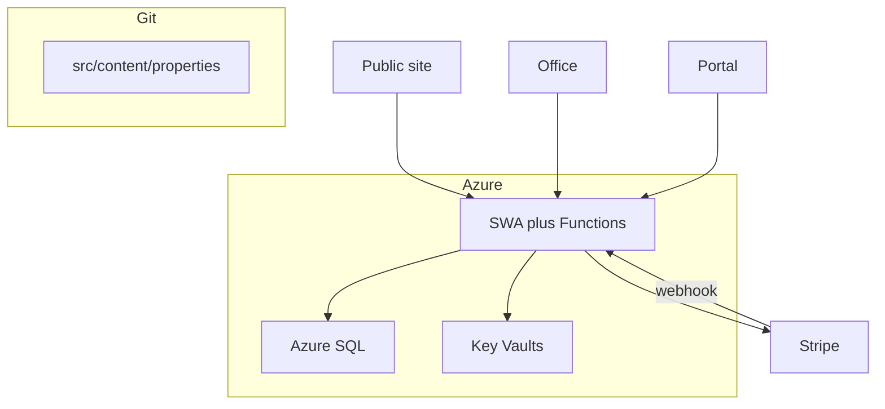

# Data persistence

**Audience:** Agents, implementers  
**Last updated:** 2026-09-27  
**Scope:** Where durable data lives, record shapes, and access paths.

There is **one application database**: Azure SQL (`wcp`). It is the single source of truth for charges, payments, and balances. Git holds public brand copy only. Stripe only processes payments (Checkout); it holds no invoices or balances of ours.

Azure SQL lives in **Central US** (`sql_location = centralus`). East US and East US 2 return `ProvisioningDisabled` for new SQL servers on this subscription; SWA, Key Vault, and the rest of each env stay in East US 2. Move SQL back with `sql_location` when a region-access exception lands.

## Systems of record

| Concern | Store | What lives there |
|---------|-------|------------------|
| **Public brand** | Git (`src/content/`) | Property listings, about page; per-unit marketing copy only |
| **Operations and money** | Azure SQL | People, applications, leases, charges (`invoices`), payments, balances, service requests, office users, **unit availability** |
| **Payment processing** | Stripe | Checkout sessions, card/ACH charges, receipts (linked from `payments.receipt_url`) |
| **Secrets** | Key Vault → SWA app settings; shared KV also holds the GitHub App PEM for CI | API keys, SQL connection, External ID, Turnstile, `wcp-terraform` credentials |
| **Staff identity** | Microsoft Entra (workforce) | Who can complete office login |
| **Renter identity** | Microsoft Entra External ID | Who can complete portal login |

```mermaid
flowchart TB
  subgraph gitSot [Git]
    Properties[src/content/properties]
  end
  subgraph azure [Azure]
    SWA[SWA plus Functions]
    SQL[Azure SQL]
    KV[Key Vaults]
  end
  Stripe[Stripe]
  Public[Public site] --> SWA
  Office[Office] --> SWA
  Portal[Portal] --> SWA
  SWA --> SQL
  SWA --> KV
  SWA --> Stripe
  Stripe -->|webhook| SWA
```

## Azure SQL

Schema: [`api/src/db/schema.sql`](../../api/src/db/schema.sql). Applied on first SQL connect. Seed: three properties and five units (bedrooms and bathrooms).

| Table | Notes |
|-------|-------|
| `properties` / `units` | Seeded; `units.available` gates `/apply` (staff toggles at turnover). Public copy still lives in git. |
| `people` | Applicants and renters; unique `email_key` (email or `phone:<digits>`); optional `stripe_customer_id` reused for portal Checkout. Staff create/update via `POST/PATCH /api/office/people` and `/office/renters` before preparing a lease. |
| `applications` | Status: submitted, in_review, approved, declined, withdrawn |
| `leases` | Filtered unique index: one **active** lease per unit. `terms_json` holds the filled Georgia lease (occupants, deposit, pets), including optional `coTenants` (adult signer records with `personId`, contact) and `additionalOccupants` (name + relationship). Staff create/update via `/office/leases` (`POST/PATCH /api/office/leases`); `status` is `active` or `ended`. Office prepares the document; office and the renter download the same current copy. The monthly charge (dwelling rent + $20/pet) is billed as an `invoices` row in SQL. |
| `invoices` | One row per lease per month: `amount_cents` (charge plus any $50 late fee), `paid_cents` (sum applied so far), `status` (`open` until `paid_cents >= amount_cents`, then `paid`). Balance due = sum of `amount_cents - paid_cents` over open rows. `stripe_invoice_id` / `hosted_invoice_url` are legacy columns from pre-Checkout Stripe Invoices and are not written for new charges. |
| `payments` | One row per amount applied to one invoice. `source` is `stripe` or `manual` with `method` (`cash`, `check`, `zelle`, `ach`, `other`), optional `notes`, `recorded_by` (staff email), and `receipt_url` for Stripe payments. A portal payment that spans several open invoices writes one row per invoice (oldest first) with `stripe_event_id = checkout:<sessionId>:<invoiceId>` so webhook retries do not double-apply. |
| `payment_checkouts` | One row per portal Checkout session (`id` = Stripe session id): `lease_id`, `person_id`, `amount_cents` chosen on our site, `status` (`open` → `processing` for submitted ACH → `succeeded` / `failed` / `expired`), `stripe_payment_intent_id`, `unapplied_cents` (overpayment beyond open charges, for staff follow-up). `processing` rows reduce what the tenant can pay again and defer the late fee only when they cover the full remaining month. |
| `tenant_communication_state` | Per-lease comms cursor: last send date/type and last invoice-notice period. Updated by the communications step of `rentDailyJobs`. |
| `communication_log` | Audit of tenant rent emails; unique `(lease_id, sent_date)` enforces at most one email per lease per NY calendar day. |
| `service_requests` | Scoped to `person_id` |
| `office_users` | Workforce identities + roles JSON |

Local/dev without `SQL_CONNECTION_STRING` uses the in-memory store (`createMemoryStore`) so tests and `func start` work offline. In-memory data is not durable across Function restarts.

## Access paths

- Public apply writes `applications` only when that property has a unit with `available = true` in Azure SQL (staff sets via `/office/unit?unitId=`). Otherwise `POST /api/apply` returns 400. Keep git marketing copy in sync for display only.
- A per-property waitlist is planned ([waitlist.md](../plans/waitlist.md)); until then, informal interest goes through contact.
- Office APIs require catalog permissions.
- Portal APIs match `people.email_key` to the signed-in email and never return other households' rows. `GET /api/portal/lease/document` is the renter's current filled lease only.
- Office `GET /api/office/leases/{id}/document` is the same HTML for print / in-person signing. In-app eSign (Entra login plus a code emailed to the address on file; one signature per adult party) is planned — [lease-esign.md](../plans/lease-esign.md). Do not add a third-party envelope vendor.
- Office `GET /api/office/leases/{id}/legal/{type}` generates HTML for `eviction-notice` or `affidavit-of-service` (query params override dates, amount due, server name). Staff preview at `/office/legal-document?leaseId=&type=`. Not persisted in SQL yet — [legal-documents.md](../plans/legal-documents.md).
- Portal `GET /api/portal/balance` returns the active lease's balance, processing amount, payable amount, minimum payment, and late-fee notice. `POST /api/portal/payments/checkout` takes `{ amountCents }`, validates it against SQL (minimum $100, or the full balance when that is smaller; at most the payable balance), creates a Stripe Checkout Session with one fixed-price line item (the tenant cannot change the amount in Stripe), and inserts a `payment_checkouts` row. Sessions expire after 31 minutes.
- Stripe webhook verifies the signature. Rent Checkout events (`metadata.wcp_checkout = rent`) update `payment_checkouts`; on payment success the amount is applied to the lease's open invoices oldest first. `charge.refunded` is logged for staff review; staff adjust SQL by hand. Legacy `invoice.paid` still marks a matching `stripe_invoice_id` row paid.
- Office `POST /api/office/payments` records manual rent (cash, check, Zelle, etc.) against an existing invoice or a lease + month (back payments within the lease term). Partial amounts are allowed up to the invoice's remaining balance, with no minimum.
- Office `GET /api/office/dashboard` includes `rentRoll` (expected vs collected for the current and next calendar month in America/New_York).
- Office `GET /api/office/units/{id}` returns unit detail for the manage panel: health, `balanceDueCents`, open invoices, lease progress, recent payments for the active lease, open service requests, and closed requests from the last 90 days (by `created_at` until `closed_at` exists).
- One timer, `rentDailyJobs`, runs late fees, then next-month charges, then communications, in that order, on a standalone Flex Consumption Function App (`func-wcp-jobs-<env>`), because SWA managed Functions are HTTP-only. It shares `api/src/lib` and reads/writes the same Azure SQL database as the SWA API, via its own `SQL_CONNECTION_STRING` app setting. Prod runs daily at 13:00 UTC; staging is disabled and runs on demand ([rent-jobs.md](../runbooks/rent-jobs.md)). One combined run keeps SQL serverless awake for a single auto-pause window. Charges are created in SQL only (10 NY days before the 1st); the $50 late fee is added after the grace period unless the month is paid in full (partial payments do not prevent it). Online payment is gated by `RENT_PAYMENTS_ENABLED`; tenant email is gated by `RENT_COMMUNICATIONS_ENABLED` / `RENT_COMMUNICATIONS_PREVIEW` (preview delivers to `CONTACT_NOTIFY_EMAIL`). Staff preview queued messages via `GET /api/office/communications/preview?date=YYYY-MM-DD`.
- CI Terraform plan downloads `GITHUB-APP-PRIVATE-KEY` from `kv-wcp-shared` (`az keyvault secret download`, never `show`) and mints a short-lived installation token. App id and installation id are repo Actions variables (`GH_APP_ID`, `GH_APP_INSTALLATION_ID`) set by `scripts/register-wcp-github-app.mjs`, not by Terraform. The PEM is not a Terraform data source. Local bootstrap apply still uses `GH_TOKEN` from `gh auth token` to write `AZURE_TF_*` Actions variables.
