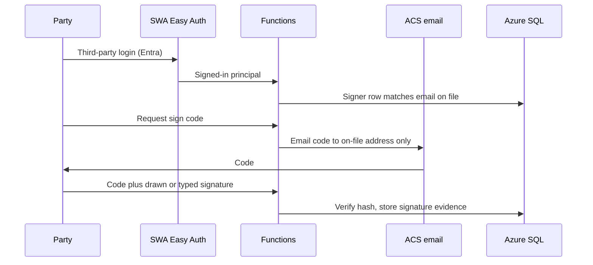

# Lease documents and in-app eSign

**Audience:** Agents, implementers  
**Last updated:** 2026-08-29  
**Status:** in_progress (prepare + print + download exist; in-app eSign does not)  
**Depends on:** [georgia-residential-lease-template.md](../legal/georgia-residential-lease-template.md), office leases, portal lease download, Entra workforce + External ID, ACS email, Stripe as money SoT

Staff prepare the Georgia lease in `/office`. Parties then **sign on this site** — not DocuSign, Adobe, or another envelope vendor. Wet-ink print remains a fallback. Azure SQL holds the operational lease row, `terms_json`, and per-party signature records. Stripe still invoices dwelling rent plus $20 per approved pet. This is not a second ledger.

## Signing model

A lease is one document and **N signatures**. Every adult named on the lease is a required signer. Occupants who are not adults (for example children listed only as occupants) do not sign.

| Party | Where they sign | First factor | Second factor |
|-------|-----------------|--------------|---------------|
| Each adult renter | `/portal/lease` | Entra External ID (SWA `externalid`) — already logged in | One-time code emailed to **that renter's email on file** |
| Landlord (WCP staff) | `/office/leases/{id}` | Workforce Entra (SWA `aad`) — already logged in | One-time code emailed to **that staff member's email on file** |

Sign-in is not permission to sign. Authn ≠ authz.

- A renter may sign **only** the signer row whose `email_key` matches the External ID email. They cannot sign a roommate's line.
- Staff may send the lease for signature and may apply the landlord signature only after `permissionGate(LEASES_WRITE)` **and** the emailed code.
- The code is never sent to an address the user typed in the form. ACS sends only to the address already stored on that signer / office user.
- Do not collect SSN or protected-class fields. Do not log or echo the code (`never-echo-secrets.mdc`).

The lease is **fully executed** only when every required signer row has `signed_at`. Until then the download is a draft / partially signed copy and the portal says who still needs to sign. One roommate signing does not bind the others.

## Actions

| ID | Status | Work |
|----|--------|------|
| LE-01 | done | Master lease + Exhibits A/B + unit defaults (including 11 Noble) and merge-field catalog in `docs/legal/`. Runtime copy in `api/src/lib/`. |
| LE-02 | planned | Counsel review of the template **and** this in-app signing flow before first new-tenant use. Record the review date in `docs/legal/README.md` (no opinions, redlines, or tenant data). |
| LE-03 | cancelled | Third-party eSign vendor. Replaced by LE-05–LE-08 (signing is built into office + portal). |
| LE-04 | done | Office prepares a lease from unit defaults + household fields, stores `terms_json`, and offers print / download. Portal offers the same current document to the renter. |
| LE-05 | planned | SQL: `lease_signers` (lease + person + role `tenant` \| `landlord` + email_key + name + sort + `signed_at` + signature evidence). One row per required party. Update [data-persistence.md](../architecture/data-persistence.md) in the same PR. Office create/edit lease collects **each adult's name and email** (not one household email only). |
| LE-06 | planned | Email a short-lived one-time code via existing ACS (`ACS-CONNECTION-STRING` / `ACS-EMAIL-SENDER`). Store only a hash + expiry. Rate-limit request and verify. Never print the code. Code goes only to the on-file address for that signer. |
| LE-07 | planned | Portal: each logged-in adult renter sees the lease, requests a code, enters the code, and signs their own line (drawn or typed legal name). They can download anytime; the file shows which lines are signed. |
| LE-08 | planned | Office: send-for-signature (notifies each unsigned tenant that the lease is ready). Landlord applies the WCP signature the same two-factor way. Staff can see who has signed and who has not. Wet-ink remains available. |

## Acceptance criteria

- [x] One fillable Georgia lease covers all five units, with downtown vs Falcon extras as fields — not five separate forms.
- [x] 11 Noble defaults include laundry-room storage, two spaces beside the apartment, Landlord yard care, max 3 occupants, and the lead exhibit.
- [x] Pets are allowed at $20 per pet per month; assistance animals are not pets and are not charged.
- [x] Deposit bank is Southern States Bank (Century Bank of Georgia was sold into it; that is not FirstBank).
- [x] Staff can prepare a lease in the office app and print it for in-person signing.
- [x] Office and the renter can download the current filled lease. Portal never sees another household's document.
- [ ] Counsel has reviewed the template and the in-app signing flow before a new household is asked to sign on the site.
- [ ] Signing is first-party on westcherokee.com (office + portal). No DocuSign / Adobe / similar envelope product.
- [ ] Two factors for every signature: (1) third-party login already in use (External ID for renters, workforce Entra for staff) and (2) a one-time code emailed to that party's **email on file**.
- [ ] A household with two or three adult renters has a signer row for each adult. Each adult logs in as themselves, receives their own code, and signs their own line. Nobody signs for someone else.
- [ ] The landlord signature is a separate required signer row. The lease is not fully executed until every required row is signed.
- [ ] Codes are hashed, short-lived, single-use, and never written to logs, git, or `GITHUB_OUTPUT`.
- [ ] No SSN, no protected-class fields, no executed leases or raw codes in git.

## Out of scope

- Changing public apply or waitlist.
- Inventing rent charges outside Stripe.
- Storing wet-ink scans in git.
- SMS codes (ACS email only unless a reviewed SMS path exists later).
- Letting a visitor sign from a magic link without External ID / workforce login.
- A second “household login” that one roommate uses to sign for everyone.

## Notes for implementers

- Today `leases.person_id` is one renter. Keep that as the billing / portal-home contact if needed, but **signatures** key off `lease_signers`, not that single person. Each adult needs a `people` row (unique `email_key`) so External ID can match.
- Reuse ACS the same way contact already does. Do not add a new email vendor.
- Signature evidence to store: signer id, UTC time, display name as signed, image or typed-name hash, and that a code was verified. Do not store the plaintext code. Do not treat the Entra session alone as the signature.
- Partial execution is normal: tenant A signed, tenant B has not. Download and office UI must show that state.
- Prod SQL is still blocked on the subscription quota (`create_sql = false`). Memory store must implement the same signer + code behavior for tests and `func start`.

## Revision notes

- 2026-08-29: LE-01 from Falcon A/B and 124 A/B.
- 2026-08-29: 11 Noble source lease added. Pets $20/month. LE-04 prepare/print/download for office and portal.
- 2026-08-29: Deposit bank set to Southern States Bank after Century Bank of Georgia was sold. That successor is not FirstBank.
- 2026-08-29: eSign is in-app (LE-03 vendor cancelled). Two-factor: Entra login plus emailed code to the address on file. Every adult renter and the landlord sign separately.
